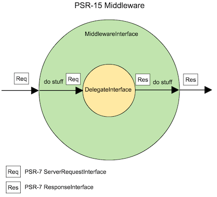

# Jugoya（十五夜）🌕

[](https://packagist.org/packages/n1215/jugoya)
[](https://packagist.org/packages/n1215/jugoya)
[](https://scrutinizer-ci.com/g/n1215/jugoya/build-status/master)
[](https://scrutinizer-ci.com/g/n1215/jugoya/?branch=master)
[](https://scrutinizer-ci.com/g/n1215/jugoya/?branch=master)

A simple HTTP application factory using PSR-15 HTTP Server Middleware.

> Jugoya is the Japanese full moon festival on the 15th day of the eighth month of the traditional Japanese calendar.

# PSR-15 HTTP Server Middleware



See [php-fig/fig-standards](https://github.com/php-fig/fig-standards/blob/master/proposed/http-middleware/middleware.md)


# What Jugoya do
Jugoya create new instance of DelegateInterface from a instance of DelegateInterface and instances of MiddlewareInterface.


# Code Example

```php
// 1. register delegate and middleware dependencies to the PSR-11 Container
/** @var \Psr\Container\ContainerInterface $container */
$container = new YourContainer();
//
// do stuff
//


// 2. create a factory
$factory = \N1215\Jugoya\HttpApplicationFactory::fromContainer($container);

// 3. create an application
/**
 * You can use one of
 *   * an instance of PSR-15 DelegateInterface
 *   * a callable having the same signature with PSR-15 DelegateInterface
 *   * a string identifier of a PSR-15 DelegateInterface instance in the PSR-11 Container
 *
 * @var DelegateInterface|callable|string $coreDelegate
 *
 */
$coreDelegate = new YourApplication();

/** @var HttpApplication|DelegateInterface $app */
$app = $factory->create($coreDelegate, [

        // You can use instances of PSR-15 MiddlewareInterface
        new YourMiddleware(),

        // or callables having the same signature with PSR-15 MiddlewareInterface
        function(ServerRequestInterface $request, DelegateInterface $delegate) {
            // do stuff
            $response = $delegate->process($request);
            // do stuff
            return $response;
        },

        // or string identifiers of PSR-15 MiddlewareInterface instances in the PSR-11 Container
        YourMiddleware::class,
    ]);


// 4. handle a PSR-7 Sever Request
/** @var Psr\Http\Message\ServerRequestInterface $request */
$request = \Zend\Diactoros\ServerRequestFactory::fromGlobals();
/** @var \Psr\Http\Message\ResponseInterface $response */
$response = $app->process($request);
```

# License

The MIT License (MIT). Please see [LICENSE](LICENSE) for more information.